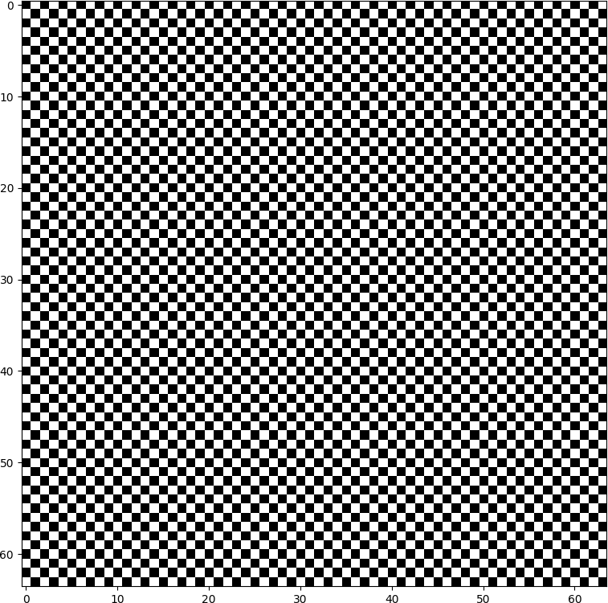
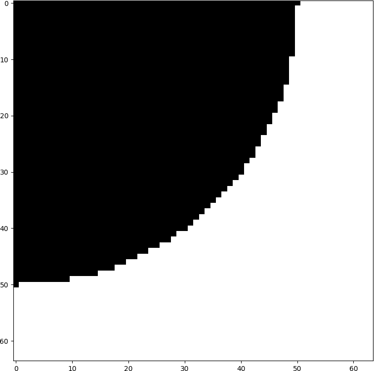
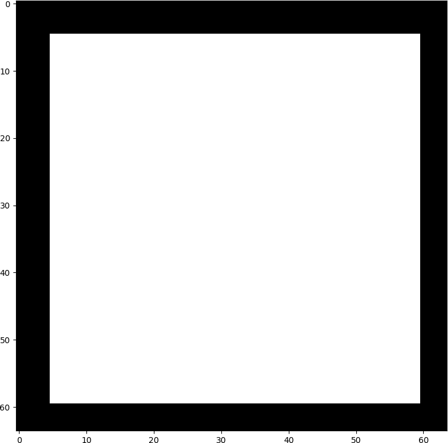

# PRG -- Jednoduché obrázky

Vytvořte program, který bude generovat jednoduché obrázky. Obrázek je
reprezentován dvourozměrným seznamem.

Koukněte se na [zaklad.py](zaklad.py) a [obrazek.py](obrazek.py).

Pro hraní s barvičkama se vám bude hodit 
<https://matplotlib.org/examples/color/colormaps_reference.html>
(abyste věděli, co napsat do parametru `cmap`).

Vytvořte:

* šachovnici
* čtvrt-kruh (použijte na to rovnici kružnice)
* rámeček
* **jeden zajímavý obrázek podle vlastního volby**

